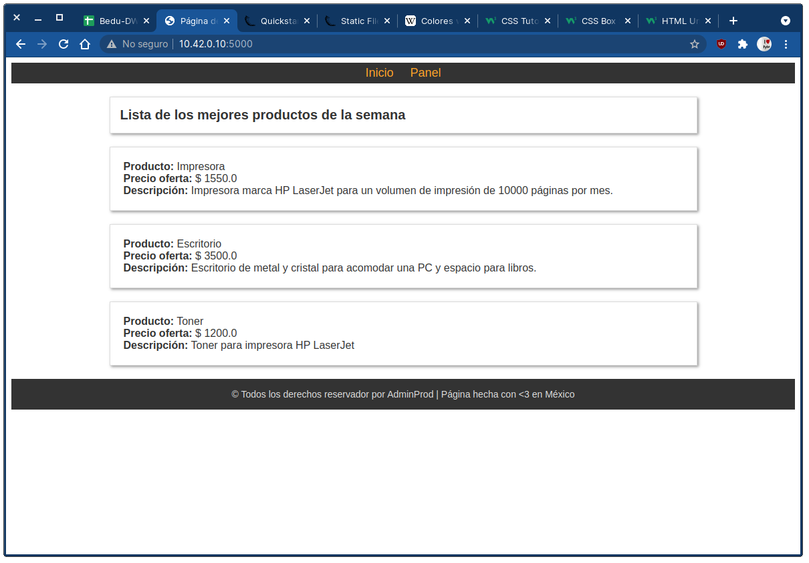
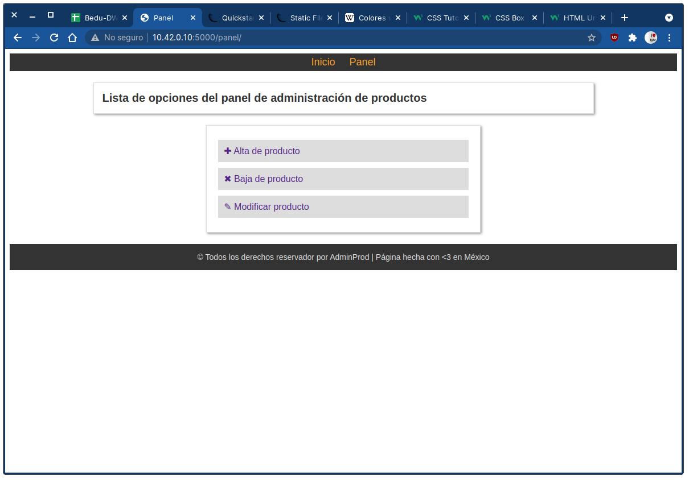
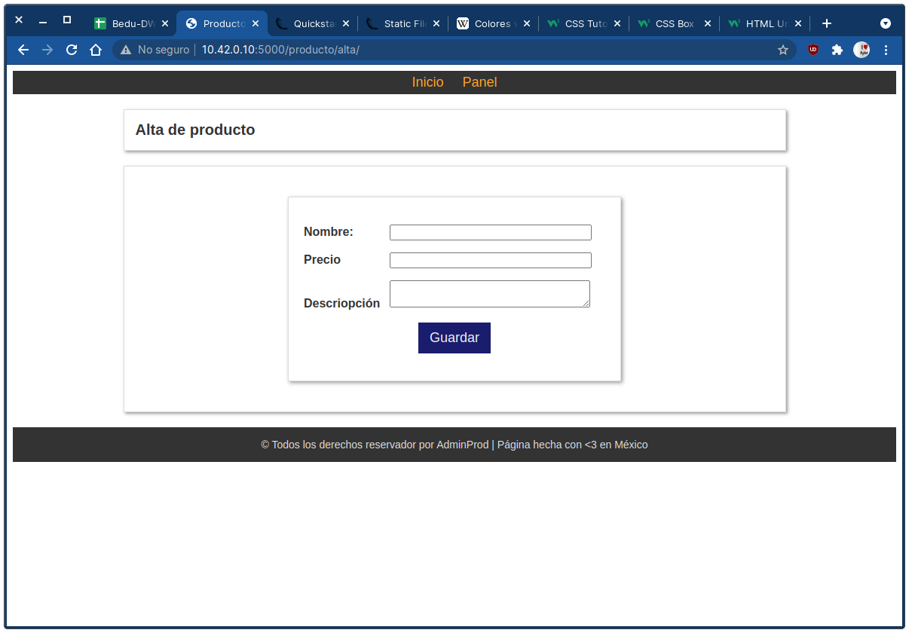

## Aplicación Web Administrador de Productos

### OBJETIVO

- Crear aplicación web con usando Flask

#### REQUISITOS

1. Python 3
2. Flask

#### DESARROLLO

Este proyecto consiste en crear una aplicación web para la administración de productos.

Se solicitan crean dos páginas:
- Página principal o de inicio que mostrará la lista de productos actuales
- Página de panel de administración que mostrará las acciones disponibles a realizar para poder realizar las operaciones de alta, baja y cambios de un producto.
- Todas las páginas deberán mostrar un menú para navegar entra las páginas y un pié indicando la marca y derechos de la aplicación.

Ejemplo de ejecución:

